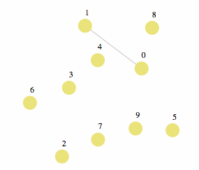
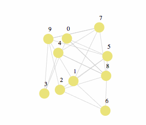

# spray-wrtc [](https://travis-ci.org/RAN3D/spray-wrtc)

<i>Keywords: Random peer-sampling, adaptive, browser-to-browser communication,
WebRTC</i>

This project aims to provide a [WebRTC](http://www.webrtc.org) implementation of
Spray.

Spray [1] is a random peer-sampling protocol [2] inspired by both Cyclon [3] and
Scamp [4]. It adapts the partial view of each member to the network size using
local knowledge only. Therefore, without any configuration, each peer
automatically adjust its functioning to the need of the network.

## Principle

<p align='center'>
    
</p>

Peers joining the network inject a logarithmic number of arcs with them. Thus, a
10-peers network has on average 2.3 connections per peer, a 100-peers network
has on average 4.6 connections per peer, a 1000 peers network has on average 6.9
connections per peer etc. Consequently, the number of connections scales well in
terms of number of peers.

The figure shows that peers are highly clustered. Furthermore, the oldest peers
have many outgoing arcs while the newest only has one outgoing arc. To solve
this issue, the peers must periodically shuffle their partial view of the
network.

<p align='center'>
    
</p>

Periodically, a peer chooses one of its neighbor to exchange with. Both peers
provide half of their partial view comprising neighbors chosen at random. Both
peers disconnect from the neighbors they provided and connect to the neighbors
they obtained. Periodic shufflings balance the outgoing arcs among the
peers. The resulting network has a low clustering coefficient.

## Installation

```$ npm install spray-wrtc```

## API

You can find the API [here](https://ran3d.github.io/spray-wrtc/).

## Example

A usage example of this module is available [here](https://ran3d.github.io/spray-wrtc/example/browser.html).

## Miscellaneous

Peersim [5] simulations of Spray are available at
[peersim-spray](https://github.com/justayak/peersim-spray).

## References

[1] B. Nédelec, J. Tanke, D. Frey, P. Molli, and A. Mostéfaoui. Spray: an
Adaptive Random Peer Sampling Protocol. <i>Technical Report, LINA-University of
Nantes; INRIA Rennes - Bretagne Atlantique, Sept 2015.</i>

[2] M. Jelasity, S. Voulgaris, R. Guerraoui, A.-M. Kermarrec, and M. Van
Steen. Gossip-based peer sampling. <i>ACM Transactions on Computer Systems
(TOCS)</i>, 25(3):8, 2007.

[3] S. Voulgaris, D. Gavidia, and M. van Steen. Cyclon: Inexpensive membership
management for unstructured p2p overlays. <i>Journal of Network and Systems
Management</i>, 13(2):197–217, 2005.

[4] A. Ganesh, A.-M. Kermarrec, and L. Massoulié. Peer-to-peer membership
management for gossip-based protocols. <i>IEEE Transactions on Computers</i>,
52(2):139–149, Feb 2003.

[5] A. Montresor and M. Jelasity. Peersim: A scalable P2P simulator. <i>Proc. of
the 9th Int. Conference on Peer-to-Peer (P2P’09)</i>, pages 99–100, Seattle, WA,
Sept. 2009.
